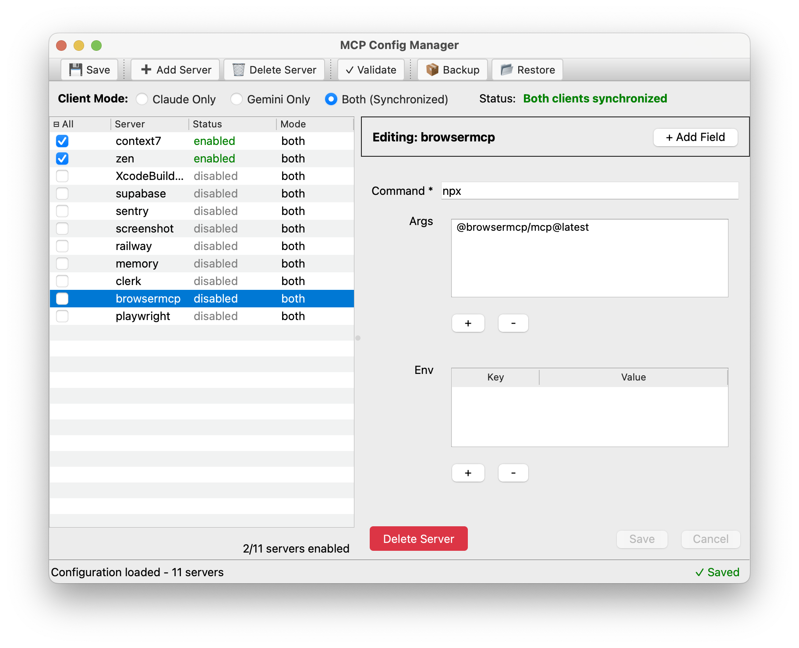

cat > README.md << 'EOF'
# MCP Config Manager

A cross-platform utility for managing Model Context Protocol (MCP) server configurations across Claude, Gemini, Codex, and other AI systems.

**Based on the battle-tested `mcp_toggle.py` script with enhanced architecture and GUI interface.**


## 🎉 Project Status

### ✅ GUI is FULLY FUNCTIONAL!
The graphical interface is complete and working with all major features operational. The application provides a modern, user-friendly way to manage MCP servers without touching JSON files.

## 🚀 Current Features

### ✅ Fully Implemented
- **🖥️ Graphical User Interface** - Modern cross-platform GUI with PyQt6/tkinter
- **📝 Server Configuration Editor** - Edit server configurations directly in the GUI
- **🔧 Field Editor System** - Dynamic field editing with real-time validation
- **🔍 Project Discovery** - Automatically discover MCP servers from project .claude.json files
- **🗑️ Bulk Server Deletion** - Delete multiple servers with confirmation dialog
- **➕ Enhanced Server Addition** - Add servers with improved JSON validation and cleanup
- **💾 Advanced Backup System** - Organized backups in dedicated directory with GUI integration
- **🔄 Server Restore** - Restore servers from backup files including disabled servers
- **Interactive CLI Management** - Full-featured interactive mode for server management
- **Multi-Client Support** - Manages `.claude.json`, `.gemini/settings.json`, and Codex configuration files
- **Server Enable/Disable** - Toggle servers on/off without losing configurations
- **Master Checkbox** - Bulk select/deselect all servers at once
- **Configuration Syncing** - Synchronize servers between Claude, Gemini, and Codex
- **Automatic Backups** - Timestamped backups before any changes
- **Preset Management** - Save and load project-specific configurations
- **Quick Preset Modes** - Minimal, web dev, fullstack, and testing presets
- **JSON Server Addition** - Add new servers by pasting JSON configurations
- **Cross-Platform Support** - Works on Windows, macOS, and Linux
- **Command Line Interface** - Full CLI with individual commands
- **Configuration Validation** - Validate config file structure
- **Visual Status Indicators** - Clear enabled/disabled status with colors
- **Keyboard Shortcuts** - Professional keyboard navigation (Ctrl+S to save, Esc to cancel)
- **Visual Polish** - Blue selection highlights, orange unsaved indicators, red validation errors

### 🚧 Next Features (Planning Phase)
- **Tkinter Support** - Alternative GUI backend for systems without Qt
- **Health Monitoring** - Real-time server connection status
- **Import/Export** - Backup and restore entire configurations

## 🚀 Quick Install (Recommended)

**One-command installation:**

```bash
curl -fsSL https://raw.githubusercontent.com/holstein13/mcp-config-manager/master/install.sh | bash
```

The installer will:
- ✅ Check system requirements automatically
- 📁 Ask where to install (with smart defaults)
- 🐍 Set up isolated Python environment
- 🔗 Add `mcp` command to your PATH
- 🖥️ Create desktop shortcuts (Linux)
- 🗑️ Provide easy uninstall option

### Quick Start After Installation

```bash
# Launch GUI (recommended)
mcp gui
# or use the alias
mcp-gui

# Interactive CLI mode
mcp interactive

# Check status
mcp status

# Show all options
mcp --help

# Uninstall easily
mcp uninstall
```

## 📦 Manual Installation

<details>
<summary>Click to expand manual installation steps</summary>

### Prerequisites
- Python 3.8 or higher
- Claude Code CLI, Gemini CLI, and/or Codex installed
- PyQt6 (optional, for better GUI experience): `pip install PyQt6`

### Clone and Install
```bash
git clone https://github.com/holstein13/mcp-config-manager.git
cd mcp-config-manager
pip install -e .

# Optional: Install PyQt6 for better GUI experience
pip install PyQt6
```

### Development Setup
```bash
# Set up development environment
python -m venv venv
source venv/bin/activate  # On Windows: venv\Scripts\activate
pip install -r requirements-dev.txt
pip install -e .

# Run tests
pytest
```

</details>

## 🚀 Usage

### GUI Mode (NEW! - Recommended)
Launch the graphical interface:

```bash
mcp-config-manager gui
```

#### macOS: Create a Native .app Bundle

For easier launching on macOS, you can create a native .app bundle that can be double-clicked, added to your Dock, or launched via Spotlight.

##### Initial Setup (One-time)

Due to macOS's externally-managed Python environment (PEP 668), you need to use a virtual environment:

```bash
# Create virtual environment
python3 -m venv venv

# Activate virtual environment
source venv/bin/activate

# Install build dependencies
pip install py2app

# Install the application in editable mode
pip install -e .

# Install PyQt6 for GUI support
pip install PyQt6
```

##### Building the .app Bundle

```bash
# Activate virtual environment
source venv/bin/activate

# Build the .app bundle (from project root)
./build_app.sh

# Or manually:
python3 scripts/build/setup_app.py py2app --dist-dir artifacts/dist

# Install to Applications folder
cp -r "artifacts/dist/MCP Config Manager.app" /Applications/
```

The app will be created in `artifacts/dist/MCP Config Manager.app`. You can then:
1. Double-click "MCP Config Manager.app" to launch
2. Launch via Spotlight (⌘ + Space, type "MCP Config Manager")
3. Add it to your Dock for quick access

##### Rebuilding After Code Changes

```bash
# Activate virtual environment
source venv/bin/activate

# Clean previous build artifacts
rm -rf build artifacts/dist

# Build the .app bundle
./build_app.sh

# Install to Applications folder
cp -r "artifacts/dist/MCP Config Manager.app" /Applications/
```

##### Troubleshooting

If the build fails:
- Make sure you're in the virtual environment (`source venv/bin/activate`)
- Check that all dependencies are installed (`pip list`)
- Clean build artifacts and try again (`rm -rf build artifacts/dist`)

If the app crashes on launch:
- Run from terminal to see error messages:
  ```bash
  /Applications/MCP\ Config\ Manager.app/Contents/MacOS/MCP\ Config\ Manager
  ```

**Note:** The .app bundle is completely self-contained with Python and all dependencies bundled. It works independently of your virtual environment once built.

The GUI provides:
- 🖥️ Visual server list with checkboxes
- ☑ Master checkbox for bulk operations (☐/☑/⊟ states)
- 📝 **Server Detail Editor** - Click any server to edit its configuration
- 🔧 **Dynamic Field Editors** - Smart editors for each field type:
  - Text fields for strings and commands
  - Number fields with validation
  - Boolean toggles for true/false values
  - Array editors for list management
  - Object editors for nested configurations
- 🔍 **Project Discovery**:
  - Discover button scans for project .claude.json files
  - Automatically finds MCP servers in your projects
  - Smart duplicate detection and consolidation
  - Location-aware server management (Global vs Project)
- ✅ **Real-time Validation** - Immediate feedback on configuration errors
- 🎨 **Visual Feedback**:
  - Blue highlights for selected servers
  - Orange indicators for unsaved changes
  - Red borders for validation errors
  - Empty state guidance when no server selected
- 💾 **Backup & Restore**:
  - Backup button creates timestamped backups
  - Restore button lists and restores previous backups
  - Automatic backups before any changes
- 🔄 Mode switching between Claude/Gemini/Codex/All
- 💾 Save button with visual feedback
- ➕ Add new servers via JSON with enhanced validation
- 🗑️ Bulk delete servers with confirmation
- 💾 Quick backup and restore with GUI feedback
- 📁 Preset management dialog
- ⌨️ Full keyboard shortcuts (Ctrl+S to save, Esc to cancel)

### Interactive CLI Mode
Launch the command-line interactive interface:

```bash
mcp-config-manager interactive
```
This gives you the complete interface from the original mcp_toggle.py script with:

- ✅/❌ Visual server status
- 🔄 Real-time mode switching (Claude/Gemini/Codex/All)
- 📁 Preset management
- ➕ Add servers by pasting JSON
- 🎯 Quick preset modes (minimal, web dev, etc.)

### Command Line Usage

```bash
# Show current status
mcp-config-manager status

# Enable/disable specific servers
mcp-config-manager enable server-name
mcp-config-manager disable server-name

# Bulk operations
mcp-config-manager enable-all
mcp-config-manager disable-all

# Backup and restore
mcp-config-manager backup           # Create timestamped backup
mcp-config-manager restore backup-file.json   # Restore from backup

# Server management
mcp-config-manager add-server server-name config.json  # Add server from file
mcp-config-manager delete-server server-name           # Delete server permanently

# Apply preset modes
mcp-config-manager preset minimal    # Only context7 + browsermcp
mcp-config-manager preset webdev     # + playwright
mcp-config-manager preset fullstack  # + supabase, clerk, railway

# Validate configurations
mcp-config-manager validate ~/.claude.json
```

### Working with Modes

The tool supports four modes:

- **Claude only** (`--mode claude`) - Only manages `.claude.json`
- **Gemini only** (`--mode gemini`) - Only manages `.gemini/settings.json`
- **Codex only** (`--mode codex`) - Only manages Codex configurations
- **All (synced)** (`--mode all`) - Keeps all configs synchronized

## 🖼️ Screenshots

### GUI Interface



*The MCP Config Manager GUI showing server configuration editing with visual feedback*

### Interactive Mode

```
🔧 MCP Config Manager - Interactive Mode
==================================================

📊 Current Status:
------------------------------
Mode: 🔄 All CLIs (synced)

✅ ACTIVE servers (will run):
  [1] context7
  [2] browsermcp
  [3] playwright

❌ DISABLED servers (won't run):
  [d1] supabase
  [d2] clerk

📋 Actions:
  [1-N]  Disable active server
  [d1-N] Enable disabled server
  [a]    Enable ALL
  [n]    Disable ALL
  [m]    Minimal (context7 + browsermcp)
  [w]    Web dev (+ playwright)
  [+]    ➕ Add new MCP server
  [p]    📁 Preset management
  [c]    🔄 Change CLI mode
  [s]    Save and exit
  [q]    Quit without saving

Action: 
```

## 🛠️ Development

### Project Structure

```
src/mcp_config_manager/
├── core/
│   ├── config_manager.py    # Main configuration management
│   ├── server_manager.py    # Server enable/disable logic
│   └── presets.py          # Preset management
├── parsers/
│   ├── claude_parser.py    # Claude config parsing
│   ├── gemini_parser.py    # Gemini config parsing
│   └── base_parser.py      # Parser interface
├── utils/
│   ├── backup.py           # Backup functionality
│   ├── sync.py             # Config synchronization
│   └── file_utils.py       # File path utilities
├── gui/                    # GUI components
│   ├── main_window.py      # Main application window
│   ├── controllers/        # GUI-library bridge
│   │   └── server_controller.py
│   ├── widgets/           # UI components
│   │   ├── server_list.py
│   │   ├── server_details_panel.py
│   │   └── field_editors/  # Dynamic field editors
│   │       ├── base.py
│   │       ├── text.py
│   │       ├── number.py
│   │       ├── boolean.py
│   │       ├── array.py
│   │       └── object.py
│   └── dialogs/           # Modal dialogs
└── cli.py                 # Command line interface
```

### Field Editor System

The field editor system provides dynamic, type-specific editors for server configuration fields:

#### Architecture
- **Base Editor** (`field_editors/base.py`): Abstract base class defining the interface
- **Type-Specific Editors**: Specialized editors for each data type
- **Factory Pattern**: `FieldEditorFactory` creates appropriate editor based on field type
- **Validation**: Real-time validation with visual feedback

#### Supported Field Types
1. **Text Editor** - Single/multi-line text fields for strings and commands
2. **Number Editor** - Integer/float fields with min/max validation
3. **Boolean Editor** - Checkbox for true/false values
4. **Array Editor** - List management with add/remove/reorder capabilities
5. **Object Editor** - Nested object editing with key-value pairs

#### Visual Feedback
- **Orange Border** - Field has been modified (unsaved changes)
- **Red Border** - Validation error with 2px width
- **Light Red Background** - Additional error indication (#FFF5F5)
- **Tooltip** - Error message on hover for invalid fields

#### Usage Example
```python
# The ServerDetailsPanel automatically creates appropriate editors
field_editor = FieldEditorFactory.create_editor(
    field_name="command",
    field_value="npx @modelcontextprotocol/server-sqlite",
    field_type="string",
    parent=self
)

# Connect signals for change tracking
field_editor.value_changed.connect(self.on_field_changed)
field_editor.validation_error.connect(self.on_validation_error)
```

### Core API Functions

The following new functions have been added across recent commits:

#### ConfigManager (core/config_manager.py)
- **`create_backup()`** - Create timestamped backups and return GUI-compatible results
- **`add_server()`** - Add a server with the interface expected by ServerController
- **Enhanced error handling** - Improved error reporting for GUI integration

#### ServerManager (core/server_manager.py)  
- **`add_server_with_name()`** - Add server with explicit name and configuration
- **`delete_server()`** - Permanently delete servers from configurations and storage
- **`update_server_config()`** - Update existing server configurations
- **Enhanced mode support** - Better handling of 'claude', 'gemini', 'codex', 'all' modes

#### Backup System (utils/backup.py)
- **`backup_all_configs()`** - Create organized backups in dedicated directory
- **`list_backups()`** - List available backup files by type
- **`restore_backup()`** - Restore configurations from backup files
- **Organized storage** - Backups now stored in dedicated `backups/` directory

#### GUI Controllers (gui/controllers/server_controller.py)
- **`add_server()`** - GUI integration for server addition
- **`delete_servers()`** - Bulk deletion with confirmation dialog
- **Enhanced event handling** - Better signal/slot management for GUI updates

#### New Dialog Components
- **`DeleteServersDialog`** - Bulk deletion with safety confirmations
- **Enhanced `AddServerDialog`** - JSON validation and cleanup features
- **`BackupRestoreDialog`** - GUI for backup and restore operations

#### JSON Processing Enhancements
- **JSON cleanup** - Remove comments and fix malformed JSON in AddServerDialog
- **Enhanced validation** - Better error reporting for invalid JSON configurations
- **Batch processing** - Support for adding multiple servers from single JSON input

### Development Setup

```bash
# Clone the repository
git clone https://github.com/holstein13/mcp-config-manager
cd mcp-config-manager

# Set up development environment
python -m venv venv
source venv/bin/activate  # On Windows: venv\Scripts\activate
pip install -r requirements-dev.txt
pip install -e .

# Run tests
pytest

# Run the application
mcp-config-manager interactive
```

## 📁 File Locations

- **Claude config:** `~/.claude.json`
- **Gemini config:** `~/.gemini/settings.json`
- **Codex config:** `~/.codex.json`
- **Presets:** `~/.mcp_presets.json`
- **Disabled servers:** `~/.mcp_disabled_servers.json` (in user's home directory)
- **Organized backups:** `~/Documents/MCP Config Manager/backups/` with timestamped files:
  - `claude-backup-YYYYMMDD_HHMMSS.json`
  - `gemini-backup-YYYYMMDD_HHMMSS.json`
  - `disabled-backup-YYYYMMDD_HHMMSS.json`
- **Legacy backups:** `~/.claude.json.backup.YYYYMMDD_HHMMSS`

## 🗺️ Roadmap

### ✅ Phase 1: Core Functionality - COMPLETE

- Interactive CLI interface
- Multi-client support (Claude + Gemini)
- Server enable/disable with storage
- Configuration synchronization
- Automatic backups
- Preset management
- JSON server addition
- Command line interface

### ✅ Phase 2: GUI Development - COMPLETE

- Cross-platform GUI framework (PyQt6/tkinter)
- Main server management window with checkboxes
- Master checkbox for bulk operations
- Preset management dialog
- Settings and configuration dialogs
- Add server via JSON paste
- Keyboard shortcuts and professional UX
- Visual status indicators and feedback

### 🚧 Phase 3: Polish & Platform Testing - IN PROGRESS

Current focus:
- ✅ macOS platform testing and optimization
- ⏳ Windows platform testing
- ⏳ Linux platform testing
- ⏳ Performance optimization for large server lists
- ⏳ PyInstaller packaging

### 📋 Phase 4: Advanced Features - IN PROGRESS

Completed:
- ✅ **Server Detail View** - Click server name to edit configuration in side panel
- ✅ **Field Editors** - Visual editors for each configuration field type
- ✅ **Real-time Validation** - Immediate feedback on configuration changes

Next features:
- **Health Monitoring** - Real-time server connection status
- **Import/Export** - Backup and restore configurations

### 🚀 Phase 5: Distribution

- Packaged installers (Windows MSI, macOS DMG, Linux AppImage)
- Auto-updater mechanism
- Plugin architecture for extensions
- IDE integrations (VS Code, IntelliJ, etc.)

## 🎯 Migration from Original Script

If you're using the original `mcp_toggle.py` script:

- **Your configs are preserved** - The tool uses the same file locations
- **Your presets carry over** - `~/.mcp_presets.json` is used directly
- **Same functionality** - All original features are available in interactive mode
- **Enhanced capabilities** - Plus new CLI commands and better error handling

## 🤝 Contributing

We welcome contributions! The original `mcp_toggle.py` script was a fantastic foundation, and we're building on that success.

### Areas for Contribution

- 🎨 **GUI Development** - Help build the cross-platform interface
- 🔍 **Server Discovery** - Auto-detect available MCP servers
- 🧪 **Testing** - Add test coverage for all components
- 📚 **Documentation** - Improve guides and examples
- 🐛 **Bug Reports** - Found an issue? Let us know!

## 📄 License

MIT License - see [LICENSE](LICENSE) file for details.

## 🙏 Acknowledgments

- Original `mcp_toggle.py` script that inspired this project
- The Anthropic team for developing the Model Context Protocol
- The open source community for feedback and contributions

---

**Ready to get started?** Run `mcp-config-manager interactive` and experience the full power of MCP server management!